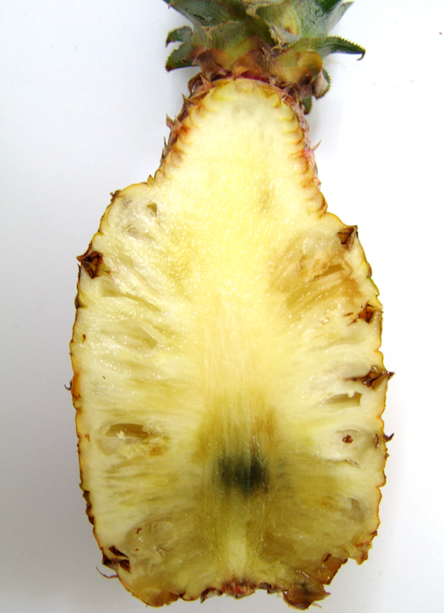
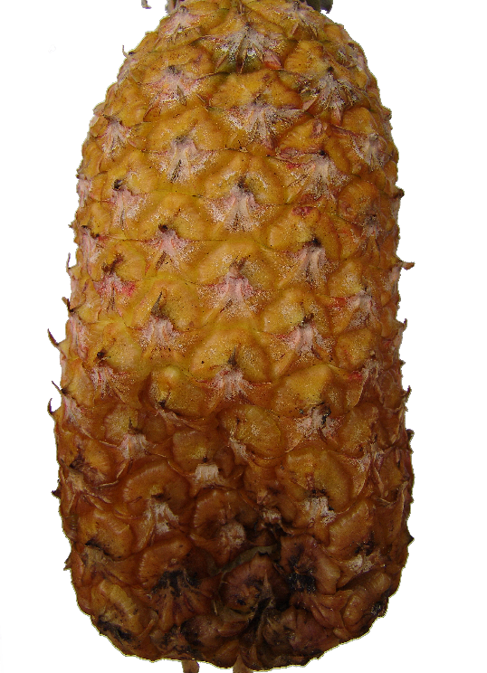
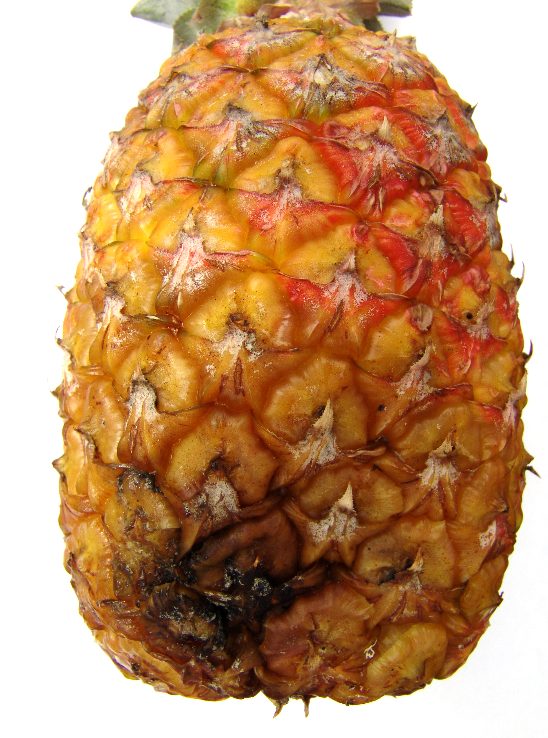
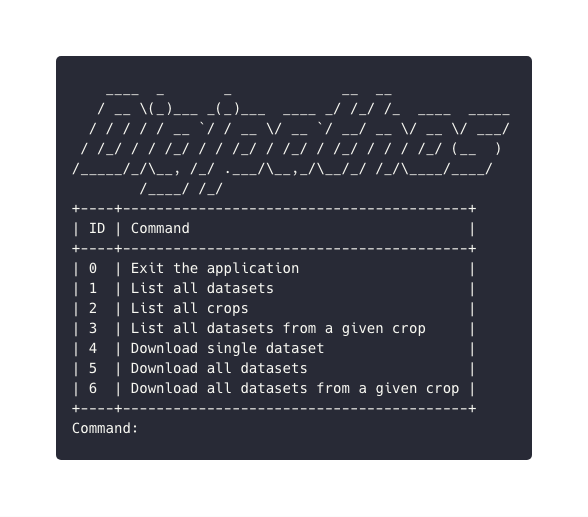
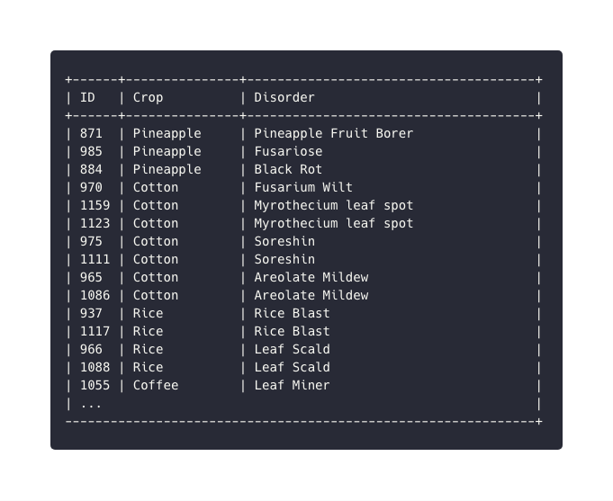

# Overview

This project is aimed to serve as a wrapper for the Digipathos dataset, in order to list and download public data from plant pathologies.

Example of pictures:

  


# Installation

The installation is pretty simple if you have a virtualenv already installed on your machine. If you don't please rely to [VirtualEnv official documentation](https://virtualenv.pypa.io/en/latest/).

```bash
pip install digipathos
```


# Testing

This project is inteded to suit most of the existent needs, so for this reason, testability is a major concern. Most of the code is heavily tested Continuous Integration tool to run all the unit tests once there is a new commit.

# Usage

You can use Digipathos in two different ways: via terminal or programatically.

## CLI (Command-Line Interface)

This mode is highly recommended for those who are looking to explore a little bit the dataset. Here you can do the same operations from the programmatic mode, but with the advantage of being able to see all the data that is being retrieved.


```bash
digipathos
```

And then you're gonna be greeted by our dataset browser :-)

<p align="center"></p>

An example listing all the datasets:

<p align="center"></p>


## Programmatically


```python
data_loader = DataLoader()

# list all the datasets
datasets = data_loader.get_datasets()

# now lets give a look at the crops
crops = data_loader.get_crops()

# how about getting all the datasets from a crop?
datasets_from_crop = data_loader.get_datasets_from_crop('Pineapple')

# now let's download a random dataset
dataset_id = random.choice(list(datasets.keys()))
data_loader.download_dataset(dataset_id=dataset_id)

# download all from a given crop
data_loader.download_datasets_from_crop('Pineapple')

# download all the datasets
data_loader.download_all_datasets()
```


# Troubleshooting

In case of any issue with the project, or for further questions, do not hesitate to open an issue here on GitHub.

# Contributions

Contributions are really welcome, so feel free to open a pull request :-)
